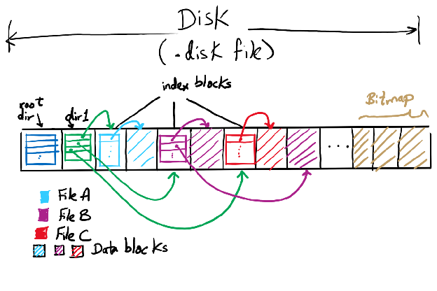
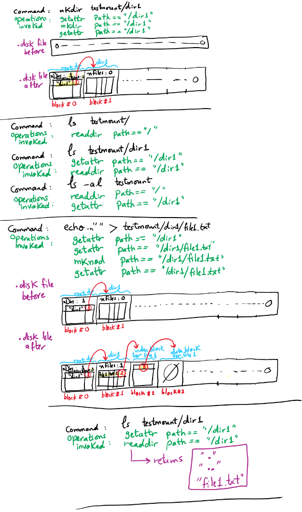

Project 4: Filesystems
======================
(_Based upon Project 4 of Dr. Misurda's CS 1550 course._)

To submit your project code, submit your GitHub Classroom repository to Gradescope. __Only the following files will be used for grading__:
- `cs1550.c`

- Due date: Friday, 4/19/2024, at 11:59 pm (EDT)
- Late due date: Sunday, 4/21/2024, at 11:59 pm EST
---

## Project Overview

[FUSE](https://www.kernel.org/doc/html/latest/filesystems/fuse.html) is a Linux kernel extension that allows a userspace program to provide the implementations for various file-related syscalls. We will use FUSE to create our filesystem, which is managed via a single file representing the disk device. Through FUSE and our implementation, it will be possible to interact transparently with our newly created filesystem using standard UNIX/Linux programs.

From an interface perspective, our filesystem will be a two-level directory system with the following restrictions/simplifications:

1. The root directory `/` will only contain other subdirectories and no regular files.
2. The subdirectories will only contain regular files and no subdirectories.
3. Many file attributes, such as creation and modification times, will not be accurately stored.

Your job is to create the cs1550 filesystem as a FUSE application that provides the interface outlined above and the implementation described below. A code skeleton has been provided to fill out; you can only modify `cs1550.c`.

## Disk management

The cs1550 filesystem should be implemented using a single file named `.disk` stored in the directory that contains the cs1550 application. The file _simulates_ a disk with 10K 512-byte blocks.

To create or reset the `.disk` file, execute the following:

- `make clean`
- `make .disk`

This will create a file that contains all zeros. You only need to do this once or whenever you want to reset the disk. (This is our "format" command.)

The disk contains different types of blocks: directories (root and subdirectories), index blocks, and data blocks for the files. Each block type has a corresponding C `struct` to hold the block contents in memory. Those `structs` are defined in `cs1550.h`.

## Root directory

In our file system, we will use block `0` of `.disk` to hold the root directory block, which points to subdirectory blocks, pointing to file index blocks, pointing to data blocks.

The `struct` holding the root directory in memory is  defined below.

```c
struct cs1550_root_directory {
	/* Block number of the last block that was allocated */
	size_t last_allocated_block;

	/* Number of subdirectories under the root */
	size_t num_directories;

	/* All subdirectories of the root */
	struct cs1550_directory directories[MAX_DIRS_IN_ROOT];

	/* Padding so the entry is one block large. Don't use this field. */
	char __padding[ROOT_PADDING];
};
```

To manage the free (or empty) space, we will keep track of the number of the last allocated block (`last_allocated_block`) and always _append_ new blocks to the previously allocated blocks. We won't reuse deleted blocks. This is an overly simplistic way to track free blocks. A scheme such as a block bitmap or a linked list of free blocks is generally used elsewhere.

Each subdirectory has an entry in the `directories` array with its name and the block index of its directory entry.

```c
struct cs1550_directory {
	/* Subdirectory name, plus extra space for the null terminator */
	char dname[MAX_FILENAME + 1];

	/* Block number of the subdirectory block in the `.disk` file */
	size_t n_start_block;
};
```

Since we are limiting the root directory to one block in size, there is a limit, `MAX_DIRS_IN_ROOT`, on how many subdirectories we can create. 

## Subdirectories

Subdirectory blocks are stored in our `.disk` file as single blocks. The corresponding in-memory `struct` is `cs1550_directory_entry` defined below.

```c
struct cs1550_directory_entry {
	/* Number of files in subdirectory. Must be less than MAX_FILES_IN_DIR */
	size_t num_files;

	/* The actual files */
	struct cs1550_file_entry files[MAX_FILES_IN_DIR];

	/* Padding so the entry is one block large. Don't use this field. */
	char __padding[DIRECTORY_PADDING];
};
```
 Since we require each subdirectory to take up only a single disk block, we are limited to a fixed number of files, `MAX_FILES_IN_DIR`, per directory. Each file entry in the directory has a filename in 8.3 (name.extension) format. We also need to record the file's total size and the location of its index block on disk.

```c
struct cs1550_file_entry {
	/* File name, plus extra space for the null terminator */
	char fname[MAX_FILENAME + 1];

	/* File extension, plus extra space for the null terminator */
	char fext[MAX_EXTENSION + 1];

	/* Size of the file, in bytes */
	size_t fsize;

	/* Block number of the file's index block in the `.disk` file */
	size_t n_index_block;
};
```

## Files

The cs1550 filesystem uses the **indexed block allocation** strategy. Files are stored alongside directories in the `.disk` file. The size of the index and data blocks is 512 bytes. Each file has one index block and zero or more data blocks. The index block is a `struct` of the format:

```c
struct cs1550_index_block {
	/* Block numbers for each data block. */
	size_t entries[MAX_ENTRIES_IN_INDEX_BLOCK];
};
```

The data block is a `struct` of the format:

```c
struct cs1550_data_block {
	/* All space in the block can be used to store file data. */
	char data[MAX_DATA_IN_BLOCK];
};
```

The figure below depicts an example of how the resulting system is logically structured.



The root directory points to the subdirectory `dir1`, which has three files, `File A`, `File B`, and `File C`, each with its own index block. `File B` has two data blocks, and both `File A` and `File C` have one data block each. Please ignore the bitmap part for this project.

## File operations

To have a simple functioning file system, we need to handle a minimum set of operations on files and directories. Just so you know, the functions are listed here in the order in which we suggest you implement them.

These operations need to return success or failure. Success is indicated by 0, and errors are indicated by returning a negative error code, as listed on the corresponding function's manual page. Example error codes are also listed in the below table.

|Function|Return values|Description|
|--------|-------------|-----------|
|`cs1550_init` (OPTIONAL)|`NULL` on success|This function includes code (e.g., opening the `.disk` file) that is run when the file system loads.|
|`cs1550_destroy` (OPTIONAL)|-|This function includes code (e.g., closing the `.disk` file) that is run when the file system is stopped gracefully.|
|[`cs1550_getattr`](https://man7.org/linux/man-pages/man2/lstat.2.html)|`0` on success, with a correctly set structure<br/>`-ENOENT` if the file is not found|This function should look up the input path to determine if it is a directory or a file. If it is a directory, return the appropriate permissions. If it is a file, return the appropriate permissions and size. The file size must be accurate since it is used to determine EOF; thus, read may not be called.|
|[`cs1550_mkdir`](https://man7.org/linux/man-pages/man2/mkdir.2.html)|`0` on success<br/>`-ENAMETOOLONG` if the name is longer than 8 characters<br/>`-EPERM` if the directory is not under the root directory<br/>`-EEXIST` if the directory already exists|This function should add the new subdirectory to the root directory, and should update the`.disk` file appropriately.|
|[`cs1550_mknod`](https://man7.org/linux/man-pages/man2/mknod.2.html)|`0` on success<br/>`-ENAMETOOLONG` if the name is beyond 8.3 characters<br/>`-EPERM` if the file is created in the root directory<br/>`-EEXIST` if the file already exists|This function should add a new file to a subdirectory. It should appropriately update the `.disk` file with the modified root and subdirectory entry structure.|
|[`cs1550_readdir`](https://man7.org/linux/man-pages/man3/readdir.3.html)|`0` on success<br/>`-ENOENT` if the directory is not found| Depending on the `path`, This function should list all subdirectories of the root, or all files of a subdirectory.|
|[`cs1550_rmdir`](https://man7.org/linux/man-pages/man2/rmdir.2.html)|`0` on success<br/>`ENOTEMPTY` if the subdirectory is not empty|This function deletes an empty subdirectory and updates the root directory.|
|[`cs1550_unlink`](https://man7.org/linux/man-pages/man2/unlink.2.html)|`0` on success|This function deletes a file and updates the subdirectory.|
|[`cs1550_truncate`](https://man7.org/linux/man-pages/man2/truncate.2.html)|`0` on success <\br> `EFBIG` if the new size is larger than the maximum file size|This function shrinks or extends the size of a file to the specified size.|

Setting up the sources 
----------------------

These instructions will help you clone the project's starter code from your GitHub Classroom private repository into Thoth.
1. Click on the GitHub Classroom link for the project on Canvas. After you link your GitHub username to the course and accept the assignment, a private repository with the name `cs1550-2244/cs1550-project4-GITHUB_USERNAME.git`, where `GITHUB_USERNAME` is your GitHub username that you have used when accepting the GitHub Classroom assignment, will be created for you.
2. Log in to Thoth using your Pitt account. From a UNIX box, you can type: `ssh PITT_USERNAME@thoth.cs.pitt.edu`, assuming `PITT_USERNAME` is your Pitt ID. From Windows, you may use PuTTY or the PowerShell ssh client.
3. Ensure you are in a private directory (e.g., your `private` AFS folder or `/u/OSLab/PITT_USERNAME` on Thoth).
4. [Generate and use personal access tokens](https://docs.github.com/en/github/authenticating-to-github/creating-a-personal-access-token) instead of passwords. By [integrating GitHub with VS Code](https://code.visualstudio.com/docs/sourcecontrol/github), you may be able to skip the need to generate and use an access token.
5. From the server's command prompt, run the following command to download the starter code of the project:
`git clone https://github.com/cs1550-2244/cs1550-project4-GITHUB_USERNAME.git` where `GITHUB_USERNAME` is your GitHub username.

## Building and testing

The `cs1550.c` file is built using the project's `Makefile`, so building and running your changes is as simple as typing `make debug`.

This will keep the program in the foreground, print out every message the application receives, and interpret the return values you're getting back. Open a second terminal window to issue the shell commands for testing.

Your first step will involve simply testing with `ls` and `mkdir`. When that works, try the commands `echo -n ""`, `rmdir`, `rm`, and `truncate -s`. - The pictures below illustrate the contents of the `.disk` file (starting from the initial content of all zeros) before and after specific commands are typed into the shell. Some of the operations that the shell will invoke are also illustrated.
.

Remember that you may want to recreate your `.disk` file (as above) if it becomes corrupted. 

You can use the commands `od -x .disk` to see the contents in hexadecimal of the `.disk` file or the command `strings .disk` to grab human-readable text from the file.

There are four test scripts, `script-1.sh` to `script-4.sh`, similar to the tests run by the autograder on GradeScope. You can run each script individually using `make test1` to `make test4`. You may want to read the tests done inside those scripts. To run the full suite of tests, use `make test`. 

## Debugging

To debug the project, follow the following steps.
- Make sure that the filesystem is unmounted. You can use `make unmount` for that.
- Run `gdb ./cs1550`
- From inside the gdb terminal, you can insert your breakpoints. Then, to run, type `r -d testmount`.

A VS Code-related issue occurs frequently when you use `gdb` for project 4 on thoth. VS Code will kick you off of thoth, prevent you from logging back on, and report a connection refused error. The following steps should fix this issue.

1. Login to thoth via the terminal, Putty, PowerShell, or any other program other than VS Code.
2. Look at all running processes under your username `ps -u ksm73` (substitute your username for ksm73)
3. Kill the processes that relate to the project (`gdb cs1550`, etc.) using `kill -9 <pid>` (replace <pid> with the process ID of the process that you want to kill).
4. Then log in to Thoth in VS Code, and you should be able to connect successfully

## Hints

- It is essential to refresh your memory on [string](https://en.wikibooks.org/wiki/C_Programming/String_manipulation) and file operations in C. [These slides from Prof. Ahn's CS 0449 class contain a brief introduction to file operations in C](https://drive.google.com/file/d/1Ia63MePBZa18D1iWqbcasoeRaeRXq-B6/view).
- Check for errors as frequently as possible. For example, check the return values of the file-related functions (`fopen`, `fseek`, `fread`, etc.).
- Your application is part of userspace, and as such, you are free to use whatever C standard libraries you wish, including file-handling ones like `fopen()`, `fread()`, `fseek()`, etc.
- If you use `fopen()`, remember to open the file for binary access.
- To open the `'disk` file you can use: `FILE * fptr = fopen(".disk","rb+");`. To write to the file: `fwrite(addressData, sizeData, numbersData, fptr)`. The parameters are the address of data to be written to the disk, the size of the data type to be written, the number of items of that type, and the pointer to the `FILE` where you want to write. To close the file: `fclose(fptr);`. To verify that you are writing, you can always write some dummy values right at the beginning of the file.
- The root directory is equivalent to your mount point. The FUSE application does not see the directory tree outside of this position. All paths are translated to relative paths automatically for you.
- To parse the path, you can use `sscanf(path,  "/%[^/]/%[^.].%s",  directory,  filename,  extension);`. You will need to check the lengths of the different parts of the path (i.e., subdirectory, file name, file extension) before calling `sscanf`.
- You shouldn't use `strtok` on the `path`. `strtok` changes its first string argument, which may cause unexpected behavior (e.g., an input/output error). Please check the BUGS section at the end of the [manual page of strtok](http://man7.org/linux/man-pages/man3/strtok_r.3.html).
- Some scripts contain hardcoded values meant for the autograder. They depend on the `MAX_FILES_IN_DIR` and `MAX_DIRS_IN_ROOT` macros inside `cs1550.h`. Those hardcoded numbers may need to be changed to make the tests pass on Thoth or on your local machine. Check how the mentioned macros depend on the size of the data types.

## File Backups

The `/u/OSLab/` partition is **not** part of AFS space. So, any files you modify under these folders are not backed up. If there is a catastrophic disk failure, all of your work will be irrecoverably lost. As such, we recommend that you:

**Commit and push all the files you change to your GitHub repository frequently!**

**BE FOREWARNED:** Loss of work not backed up is not grounds for an extension.


## Submission

We will use an automatic grader for Project 4. You get unlimited attempts until the deadline. You need to submit your GitHub repository to Gradescope. **You may not change the directory structure or file locations**.


## Grading rubric

The rubric items can be found on the project submission page on Gradescope. There is no manual grading for this project.

Please note that the score that you get from the autograder is not your final score. We still do manual grading. We may discover bugs and mistakes that were not caught by the test scripts and take penalty points off. Please use the autograder only as a tool to get immediate feedback and discover bugs in your program. Please note that certain bugs (e.g., deadlocks) in your program may or may not manifest themselves when the test cases are run on your program. It may be the case that the same exact code fails in some tests then the same code passes the same tests when resubmitted. The fact that a test once fails should make you debug your code, not simply resubmit and hope that the situation that caused the bug won't happen the next time around.
