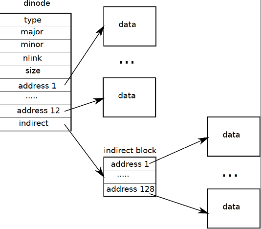

# CS 1550 Lab 5 - Bigger Files For XV6

_(Based on https://pdos.csail.mit.edu/6.828/2017/homework/xv6-big-files.html)_

In this lab, you'll increase the maximum file size in XV6. Currently, XV6 files are limited to 140 sectors (512 bytes each) or 71,680 bytes. This limit comes from the fact that an XV6 i-node contains 12 "direct" block numbers and one "singly indirect" block number, which refers to a block that holds up to 128 more block numbers, for a total of 12+128=140. You'll change the XV6 file system code to support a "doubly indirect" block in each inode, containing up to 128 addresses of singly-indirect blocks, each of which can contain up to 128 addresses of data blocks. The result will be that a file can consist of up to 16523 sectors (or about 8.5 megabytes).

##	PRELIMINARIES

Modify your Makefile as follows:

1. Change `CPUS` definition so that it reads:
```
CPUS := 1
```
2. Add
```
QEMUEXTRA = -snapshot
```
right before `QEMUOPTS`.

The above two steps speed up qemu tremendously when XV6 creates "large" files.

Since the `mkfs` program initializes the file system to have fewer than 1000 free data blocks, which are too few to show off the changes you'll make, modify `param.h` to set `FSSIZE` to:
```c
    #define FSSIZE       20000  // size of file system in blocks
```

Create a file named `big.c` with the following contents in your XV6 directory.

```c
#include "types.h"
#include "stat.h"
#include "user.h"
#include "fcntl.h"

int
main()
{
  char buf[512];
  int fd, i, sectors;

  fd = open("big.file", O_CREATE | O_WRONLY);
  if(fd < 0){
    printf(2, "big: cannot open big.file for writing\n");
    exit();
  }

  sectors = 0;
  while(1){
    *(int*)buf = sectors;
    int cc = write(fd, buf, sizeof(buf));
    if(cc <= 0)
      break;
    sectors++;
	if (sectors % 100 == 0)
		printf(2, ".");
  }

  printf(1, "\nwrote %d sectors\n", sectors);

  close(fd);
  fd = open("big.file", O_RDONLY);
  if(fd < 0){
    printf(2, "big: cannot re-open big.file for reading\n");
    exit();
  }
  for(i = 0; i < sectors; i++){
    int cc = read(fd, buf, sizeof(buf));
    if(cc <= 0){
      printf(2, "big: read error at sector %d\n", i);
      exit();
    }
    if(*(int*)buf != i){
      printf(2, "big: read the wrong data (%d) for sector %d\n",
             *(int*)buf, i);
      exit();
    }
  }

  printf(1, "done; ok\n"); 

  exit();
}
```

Add the file to the `UPROGS` list in `Makefile`, start up XV6, and run `big`. The `big` program creates a file as big as XV6 allows and reports the resulting file size. It should say 140 sectors.

## WHAT TO LOOK AT

The format of an on-disk inode is defined by `struct dinode` in `fs.h`. You're particularly interested in `NDIRECT`, `NINDIRECT`, `MAXFILE`, and the `addrs[]` element of `struct dinode`. Below is a diagram of the standard xv6 inode.


 
The code that finds a file's data on disk is in `bmap()` in `fs.c`. Look at it and ensure you understand what it's doing. `bmap()` is called both when reading and writing a file. When writing, `bmap()` allocates new blocks as needed to hold file content and indirect blocks if needed to hold block addresses.

`bmap()` deals with two kinds of block numbers. The `bn` argument is a "logical block" -- a block number relative to the start of the file. The block numbers in `ip->addrs[]`, and the argument to `bread()`, are disk block numbers. You can view `bmap()` as mapping a file's logical block numbers into physical disk block numbers.

## YOUR TASK

Modify the i-node structure to implement direct block entries, one singly-indirect, and one doubly-indirect entry. To make room for your new doubly indirect entry, you'll have to have only 11 direct block entries rather than 12; you're not allowed to change the size of an on-disk inode. The first 11 elements of `ip->addrs[]` should be direct block entries, the 12th be a singly-indirect entry, and the 13th be your new doubly-indirect entry. You will also have to modify `map ()` to reflect the changes in the i-node structure on the block mapping algorithm.

You don't have to modify XV6 to handle the deletion of files with doubly-indirect blocks.

If all goes well, `big` will now report that it can write **16523 sectors**. It will take `big` a few dozen seconds to finish.

##	HINTS

- Please make sure you understand why adding a doubly indirect entry increases the maximum file size by 16,384 blocks (actually just 16383, since you have to decrease the number of direct entries by one).

- Make sure you understand `bmap()`. Draw a diagram of the relationships between `ip->addrs[]`, the singly indirect entry, the doubly indirect entry, the singly indirect blocks it points to, and the data blocks pointed to by those singly indirect blocks. Think about how you'll index into the doubly-indirect block and the singly-indirect blocks it points to with the logical block number.

- If you change the definition of `NDIRECT`, you'll probably have to change the size of `addrs[]` in `struct inode` in `file.h`. _Make sure that `struct inode` and `struct dinode` have the same number of elements in their `addrs[]` arrays_.

If you change the definition of `NDIRECT`, make sure to create a new `fs.img` since `mkfs` uses `NDIRECT` to build the initial file systems. If you delete `fs.img`, recompiling XV6 will build a new one for you.

- If your file system gets into a bad state, perhaps by crashing, delete `fs.img` then run `make` to build a new clean file system image.

- Don't forget to `brelse()` each block that you `bread()`. `brelse()` releases the buffer cache for the block (check `bio.c`).

- You should allocate singly-indirect blocks and doubly-indirect blocks only as needed, like the original `bmap()`.


##	SUBMISSION INSTRUCTIONS
Submit to GradeScope the files you have modified within the source code of XV6. You should modify the following files only:

- `file.h`
- `fs.h`
- `param.h`
- `fs.c`
- `Makefile`
